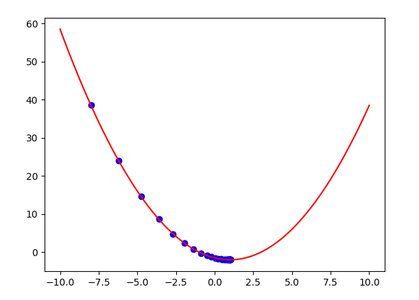

# BK AI Amateur

This is the project about initial steps into AI field.

## Description

The group works with basis Machine Learning idea like: Gradient Descent, Linear Regression, k-Means... Later on, 
expand to the field of Computer Vision, Generative Model and basic Transfer Learning.

## Quick recap

### Dependencies

* Google Colab (either CPU or GPU)
* [Numpy](https://numpy.org/)
* [Matplotlib](https://matplotlib.org/)
* [Pygame](https://github.com/pygame/pygame)
* [Scikit-Learn](https://scikit-learn.org/stable/)
* [Pillow](https://pillow.readthedocs.io/en/stable/)
* [TensorFlow](https://www.tensorflow.org/)
* [PyTorch](https://pytorch.org/)

### Installing

```
git clone https://github.com/electrodrago/colab-learning.git
```

### Executing program

* First run the command line below
* `cd` to the target folder store the file and run
```
pip install -r requirements.txt
cd colab-learning
```

## Overview

`ML_basis` have 3 directories `GradientDescent`, `K-means` and `LinearRegression`. <br>
### GradientDescent
* `GR_report.py` work with Gradient Descent, provide basic code and visualization of
how Gradient Descent work.

* `linear.py` is Gradient Descent approach to solve the problem of 
Linear Regression.

### k-Means
* `xuli.py` work with k-Means clustering to find k most density distributions of colors
in the image, change the pixels of those exterior points to its related cluster, the result
is nearly the same image but reduce the capacity of the image.
* * From:<br>

* * To:<br>

### LinearRegression
* `parabol.py` work with matrix multiplication to fix the best
line to the scattered point, use the mechanism of Linear Regression
matrix multiplication.

* `imglm.py` work with images, perform slightly color change adaptive.
* * From:<br>

* * To:<br>


## Generative Adversarial Network

### GAN result with Pokemons

### GAN result with MNIST dataset

